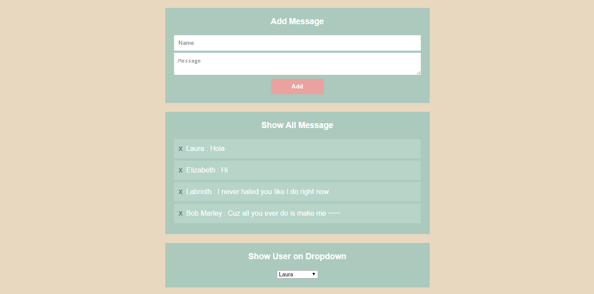

# node.js-demo_mysql

*Using MySQL with Node.js*

### Feature
- Add Data
- Show Data
- Delete Data

### How to install
0. Import [file Database](https://github.com/iamblocksberg/node.js-demo_mysql/blob/master/_File%20Database/awesome_db.sql) to your Database 
1. cd project
2. npm install
3. npm start

